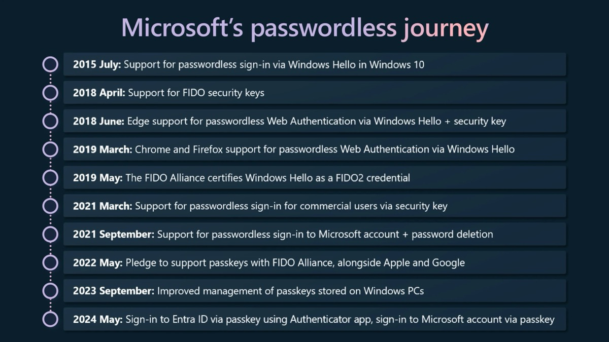
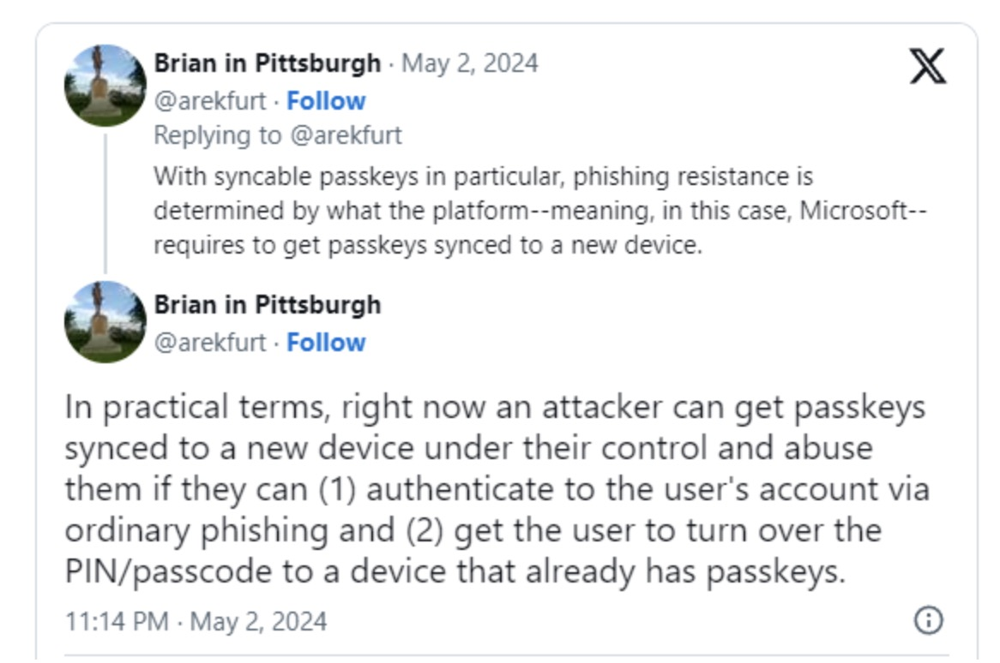
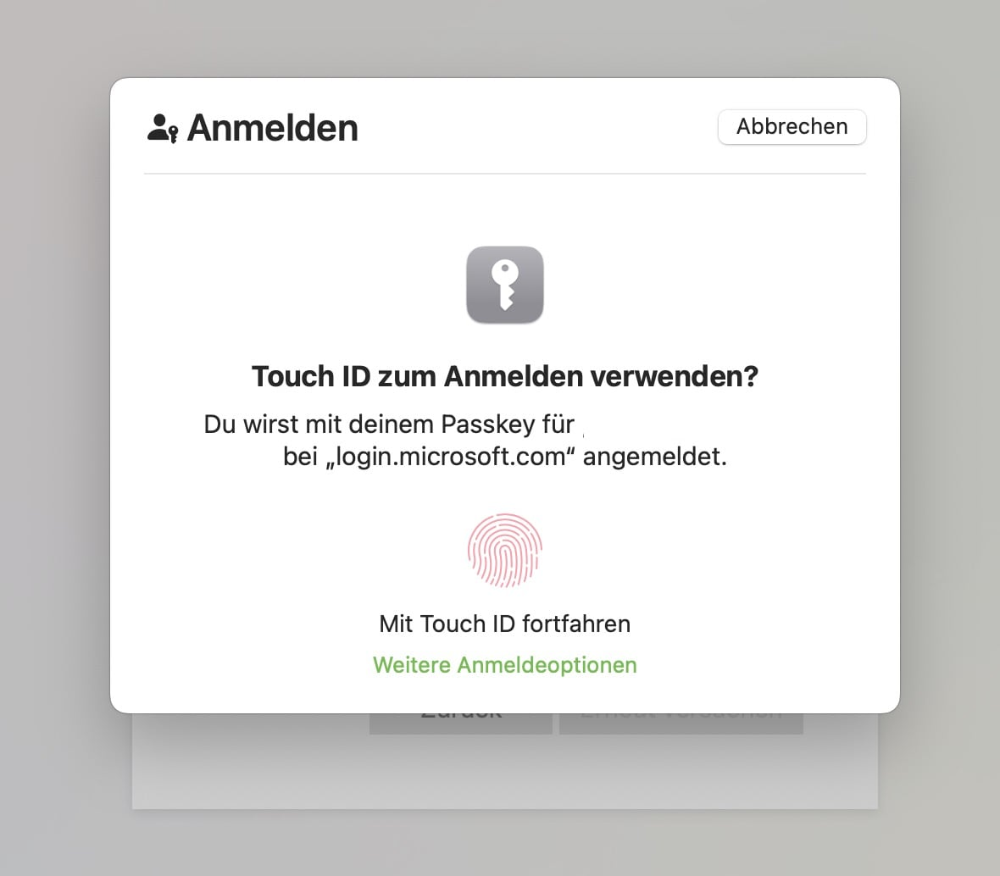

## Passkeys aren't all that new and many users who subscribe to personal Microsoft 365 services or use private Microsoft accounts have been clamoring for this feature. The good: It's here, matching this year’s World Password Day. The bad: Microsoft is doing Microsoft things - again!

[Passkeys](https://www.passkeys.com) are a more secure and easier replacement for passwords. They allow users to log in to applications and websites using a biometric sensor (such as a fingerprint or facial recognition like Windows Hello etc.), PIN or pattern, freeing them from the hassle of remembering and managing passwords. Yesterday I also [blogged](https://pifferi.info/bitwarden-launches-new-mfa-authenticator-app/) about the new Bitwarden Authenticator and mechanisms already implemented into the parent Bitwarden Password Manager - including support for passkeys.

These days, [Microsoft is joining the party, finally bringing passkeys to consumer Microsoft 365-accounts](https://www.microsoft.com/en-us/security/blog/2024/05/02/microsoft-introduces-passkeys-for-consumer-accounts/), following in the footsteps of all the other modern services that have already implemented passkeys. Now, users can log in to their Microsoft consumer accounts with a passkey, allowing them to continue to use password-free authentication methods such as Windows Hello, FIDO2 security keys, biometric tools (facial scans or fingerprints) or device PINs to strengthen their layer of security.

Microsoft further clarifies the term "consumer accounts" to mean personal accounts for access to Microsoft services and products such as Windows, Microsoft 365 including the specific services contained therein, the all-new Copilot and the Xbox Live-services.

## Hello, passkeys

Well, passkeys are finally here for Microsoft consumer accounts, and this integration has been long overdue. Passkey support for Microsoft Windows for logging into websites and applications was already available but with the addition of support for Microsoft-led online accounts, consumers can now log in with ease, following the long-announced roadmap to finally ditch passwords.

Technically, passkeys are a variant of a passwordless authentication mechanism that uses a cryptographic key pair. While the public key is stored on the service provider's server, the private key is securely stored on the user's device. When the user attempts to authenticate, a challenge is created that requires the private key to solve and confirm the user's identity. Because the private key is protected by device-level security mechanisms such as PIN or biometrics, the user only needs to provide this information to seamlessly log in.

Over the past few months and years, we have already seen the growth of services supporting passphrase authentication and even its deep integration into operating systems or browsers (MacOS / Safari paired with Touch ID) or separate password managers like [Bitwarden](https://pifferi.info/bitwarden-launches-new-mfa-authenticator-app/), which also comes with its OS-independent implementation of passphrase support.

## The need to sync for convenience-reasons

Passkeys are usually tied to specific devices but with deeper integration into single solutions, there is also an option to sync them and make them available on all devices: Apple did this with the iCloud Keychain (with pros and cons but [documented](https://support.apple.com/en-us/102651)) and also, for example,  Bitwarden's sync feature allows users to use passkeys on all devices in use if they are initially configured to do so. On the other hand, you can also add each single device to specific accounts when omitting a sync, for example for security reasons or simply no need to sync at all.

Unfortunately, Microsoft wouldn't be Microsoft these days if the road of good intentions wasn’t paved with some questionable intentions: Redmond also synchronizes passkeys with other connected devices rather than just storing unique passkeys on each device. Technically, this isn't the most secure method because if an attacker gains access to a particular account, all of the configured passkeys will be synced to that device. According to Microsoft, this decision was made „for reasons of convenience“, allowing people to maintain access to their accounts when upgrading or losing their devices.

The process of creating passkeys is fairly straightforward and well documented in [Microsoft's official support document](https://support.microsoft.com/en-us/account-billing/signing-in-with-a-passkey-09a49a86-ca47-406c-8acc-ed0e3c852c6d).

Just follow your device's instructions on supported systems (Windows 10 and later, macOS Ventura including Safari 16 or later, iOS 16 and later, Chrome/ChromeOS, Microsoft Edge 109 and later or Android 9 and later): When signing in to your Microsoft account, select "Other ways to sign in," select "Face, fingerprint, PIN, or security key" and then select the passkey you saved earlier from the list or use the OS-specific dialog like this one in Safari on macOS Sonomo 14.4.1 running Safari 17.4.1.

It’s good to finally see Microsoft adopting passkeys for personal accounts, enhancing the overall layer of security. Seen from a different perspective, „security“ is something that Microsoft is currently struggling with so syncing the passkeys while referring to „convenience“ is something that has a rather foul taste: The foul taste of gathering as much personal information about the user a possible, effectively going the Google-way and without a technical justification how the sync works and how the passkeys are protected.

**The good:** Passkeys are finally here for non-business accounts!\
**The bad:** Microsoft continues to do the Microsoft things of our time while still struggling with security and trust these days, so it would be nice to have some more clarity on the protection of the newly implemented passkeys...