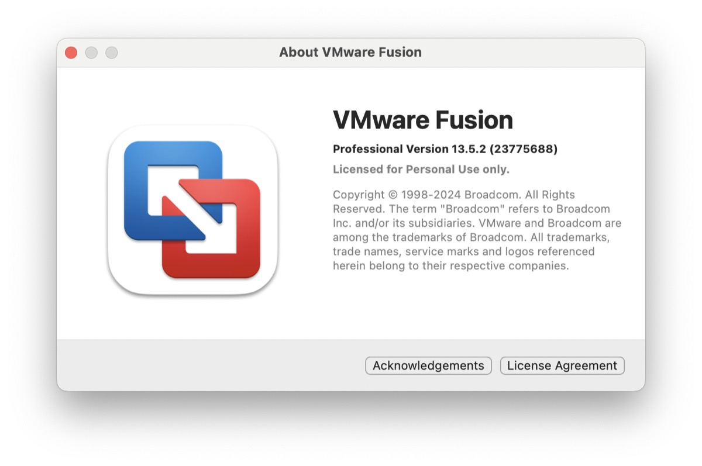
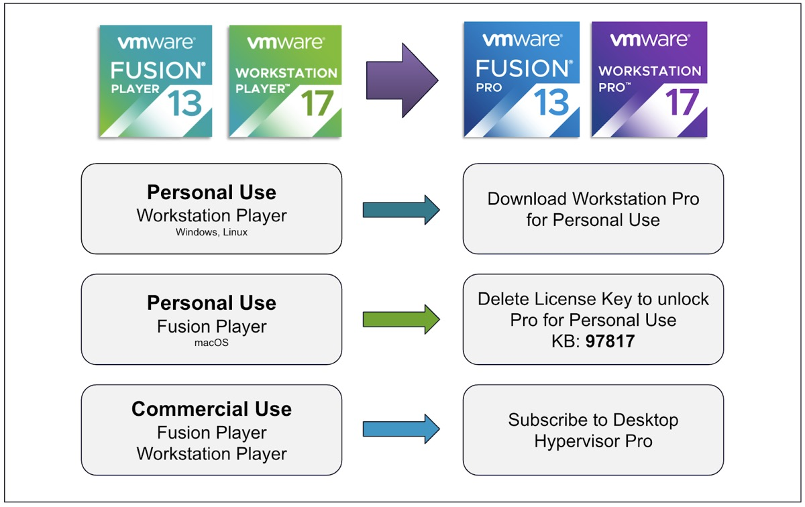
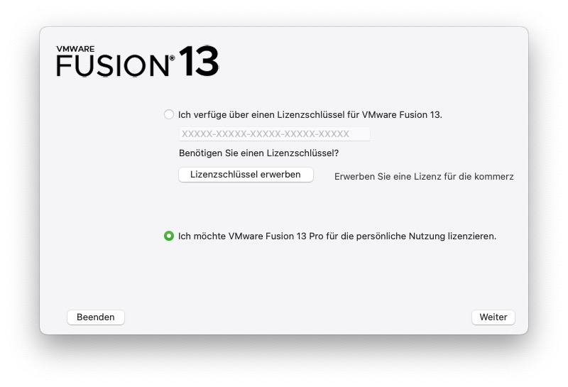

## While Broadcom still does Broadcom-things after acquiring VMware and turning pricing and portals upside down, at least the question what happens with the Desktop-products seems to have been answered.

Michael Roy, product line manager for desktop hypervisor products such as VMware Fusion and Workstation, may already be familiar to users of these products. Now he has [blogged] (https://blogs.vmware.com/teamfusion/2024/05/fusion-pro-now-available-free-for-personal-use.html) about the latest state of VMware Workstation and Fusion after the acquisition. While rumors were already circulating that the entire desktop division would be sold anyway, the blog post seems to clarify that the Desktop hypervisors will remain despite Broadcom's decision to kill off the popular "Player" editions no matter what.

> „Our goal with these changes has been to simplify how we bring VMware Desktop Hypervisor apps to market, while maintaining our support of the broader community of VMware Workstation and Fusion users of both free and paid products. So let’s dig into this simplification and more importantly, what this means to you as customers.“

The most significant part of this statement is that Fusion Pro and Workstation Pro will now have two licensing models. Broadcom now offers a "free personal use" or a "paid commercial use“-subscription for these applications. Depending on their specific use cases, users can now decide which license model is right for them: Anyone using the software for work on Windows, Mac or Linux will need a commercial edition, as was the case in the "VMware“-days before Broadcom.

While the specific Pro-installer-files provides all options letting the user decide which edition to use, the „lesser counterparts“ named VMware Workstation Player and VMware Fusion Player have been officially discontinued. Everyday users who need to create a virtual lab on their Mac, Windows or Linux computer can do so for free simply by registering and downloading the specific installers.

## Goodbye, Players!

Users with Fusion Player Personal Licences can simply update to Fusion 13.5.2 and delete their specific licence key. Updating to 13.5.2 is mandatory here, but removing the existing player key will unlock the full "Pro for Personal Use" licence without the need for any additional keys. The whole process is described in a simple KB that describes what needs to be done at https://knowledge.broadcom.com/external/article?articleNumber=367660.

As with Workstation Player for Windows and Linux, Workstation Pro requires a new download and installation but is licensed for personal use by default. Users will need a customer account at [support.broadcom.com](support.broadcom.com) to access the downloads as described below. Fusion Player 13 and Workstation Player 17 commercial licence customers will continue to see their products work and no new licence keys will be required to continue using these versions. According to Roy, once active support has expired, customers are encouraged to upgrade to the Pro version of these products for continued support and updates.

With the new commercial model, VMware has also reduced its product line offerings to a single SKU for users requiring commercial licensing, eliminating more than 40 other SKUs and making it easier than ever to quote and purchase VMware Desktop Hypervisor-applications, Fusion Pro and Workstation Pro in the Enterprise. Subscriptions can be purchased from any Broadcom Advantage Partner or Digital River, which many users may be familiar with from reselling licences for other products. The VMware Desktop Hypervisor subscription is priced at $120/year and can also be purchased from the new [online store] (https://store.cloudvista.com).

## How to get the personal use-editions

The way to download the current version of VMware Workstation or Fusion for Personal Use is pretty straightforward once you have access to an an either migrated or freshly created account at Broadcom.

- Register for an account at [https://support.broadcom.com](https://support.broadcom.com) or
- Login to an existing one
- Search for your specific edition of the personal edition by using one of these links ([Fusion](https://support.broadcom.com/group/ecx/productdownloads?subfamily=VMware%20Fusion) / [Workstation](https://support.broadcom.com/group/ecx/productdownloads?subfamily=VMware%20Workstation%20Pro))
- Download the corresponding edition
- Install the software and opt in for the „personal use license“ instead of entering a key for commercial use

Aside from all the hullabaloo surrounding Broadcom's acquisition of VMware and the downsides in terms of stripped down editions and new pricing, this move was rather unexpected and will at least satisfy people who used the (now discontinued) Player. It also seems to put an end to the uncertain status quo of being able to download any update to Fusion or Workstation, but this may just be a drop in the ocean of a VMware in 2024.

So, after all, let’s enjoy this lump of sugar as long as possible!