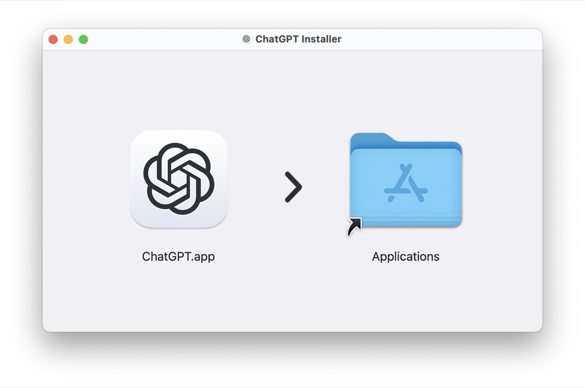
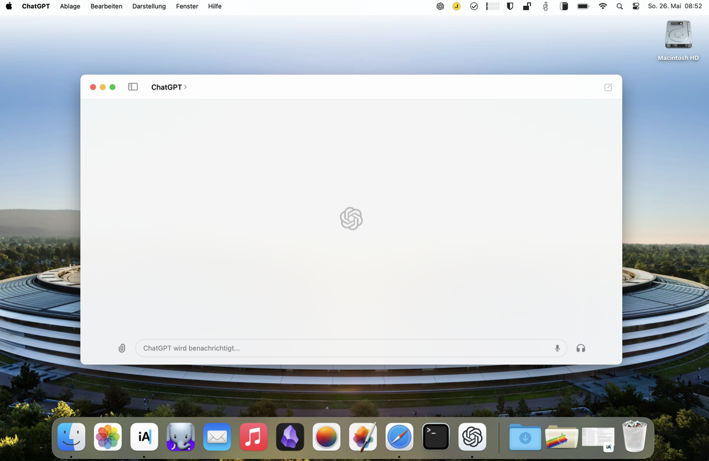

## This month, OpenAI has [released the native ChatGPT-app for macOS alongside GPT-4o](https://openai.com/index/gpt-4o-and-more-tools-to-chatgpt-free/). Anyone can install this app yet but your account will still need early access if you already want to use ChatGPT on the Mac-desktop - but there is a workaround!

Yesterday, OpenAI [shared](https://help.openai.com/en/articles/9275200-using-the-chatgpt-macos-app) the status quo that the macOS-app is limited to “Plus and Team users” and that it will be rolling out more widely „in the coming weeks.“

> We have rolled out the macOS app to Plus and Team users, and we will make it more broadly available in the coming weeks. We also plan to launch a Windows version later this year.

For those who have already managed to get their hands on the app without a subscription, the experience should look like the picture above after logging in. If you are interested in getting the app and perhaps using a small workaround to get it now despite having an active subscription, read on!

## Getting the app

Once you have one of these subscriptions, you can (of course) download the app instantly by logging into ChatGPT on the web, clicking on your profile icon in the top right corner and then selecting "Download the App". It's as simple as that! If you don't have a subscription and your Mac meets the requirements (at least an Apple Silicon based on Apple's M1 SoC and the latest MacOS 14 "Sonoma"), check out the official [thread](https://community.openai.com/t/downloading-the-new-desktop-app-for-chatgpt/746857) or use [this](https://persistent.oaistatic.com/sidekick/public/ChatGPT_Desktop_public_latest.dmg) link to download the official .DMG file. Drag and drop it into your „Applications“-folder and you are ready to go, too!

## How to skip the waitlist

Originally discovered and shared by [Diego Jimenez](https://x.com/diegojimenez/status/1793287205542076524) the workaround to skip the waitlist looks like this:

- Open ChatGPT for Mac and login
- Quit the app after the window size changes but before the login error appears (use Command+Q for more speed here)
- Relaunch the app and discover it should be working

It may take a turn or two to catch the right moment but after this procedure, even basic users without a subscription will now be able to use ChatGPT for Mac. We don't know how long this workaround will last so if you're interested in using the Mac desktop-client without a paid plan, hurry up!