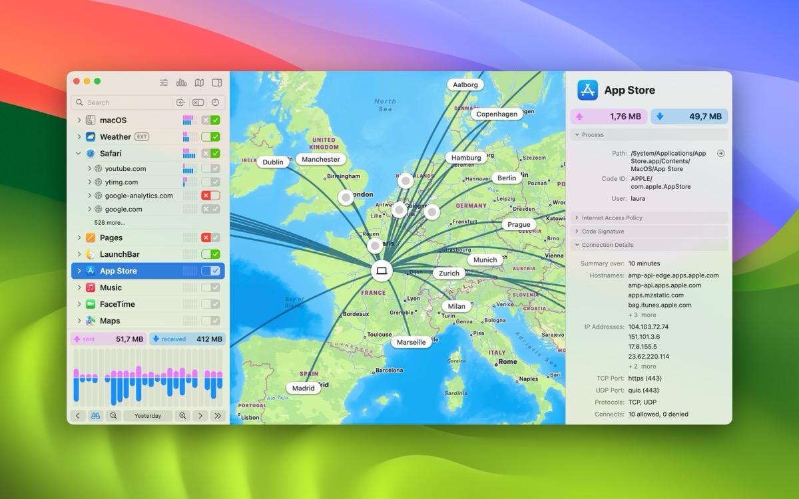
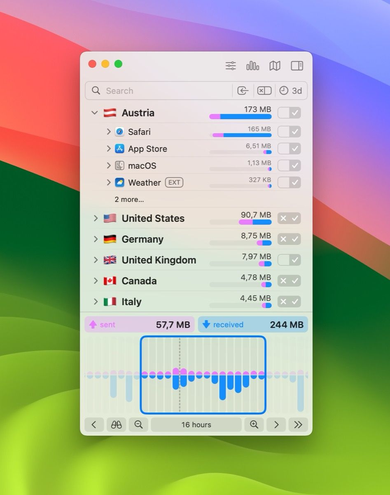
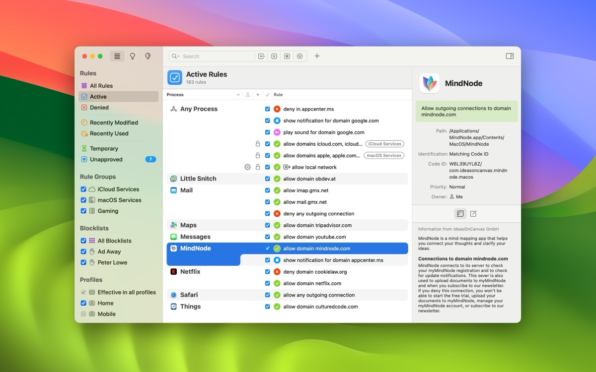
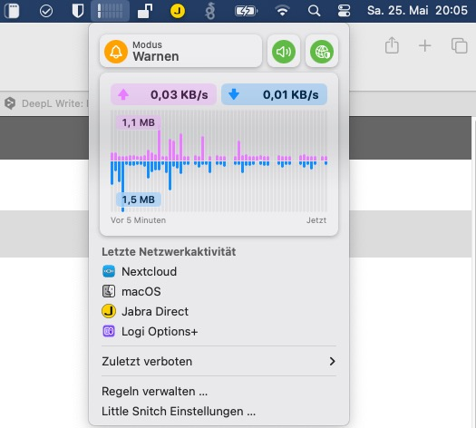

## [Four years ago I blogged about Little Snitch 5](../Little-Snitch5-makes-the-successful-switch-to-macOS-11-Big-Sur/), a software firewall-like product from Austrian company Objective Development, which successfully made the transition to MacOS 11 Big Sur. Now Little Snitch 6 has been released and continues to be an important building block in the security strategy of privacy-conscious users.

Whether on Windows, Mac or Linux, using a particular operating system is always a matter of trust. Some people don't care at all, some prefer to avoid the big tech vendors, and some even want to use the system they personally prefer with an extra pinch of salt, controlling exactly what kind of communication leaves the specific machine.

While there are many solutions and software formerly known as "personal firewalls", especially in the Windows genre, my preferred macOS actually comes just with a simple and basic firewall on board: "Keeps things out" as a first point of defense but lacks a certain granularity in terms of detailed configuration options to specifically choose which services or data can be transferred from (!) the inside to the World Wide Web. Solutions like Objective-See's [LuLu](../LuLu-Yet-another-powerful-firewall-for-your-Mac/) are great options in the Open Source-genre while [Objective Development's Little Snitch](https://www.obdev.at/products/littlesnitch/index-de.html) (enter, version 6!) is a paid alternative that has been with me for many years now.

## Welcome, Little Snitch 6!

Specifically, Little Snitch has not only been with me for many years but also with many Mac users who can look back on 20 years of history. As I mentioned above, there are many solutions out there that try to make your Mac more private and Little Snitch is one of them, with the aforementioned history. Basically, it sniffs („snitches!“ the network traffic on all your connected devices and either allows, denies or warns about traffic initiated by software installed on the Mac.

My use case has always been "deny all" in terms of incoming (of course) and outgoing traffic. For me, the way Little Snitch works is that once it is deployed and allowed to sniff the traffic, it alerts me on every connection that any kind of software or service initiates and lets me choose what actions to take for that specific request: For example, a local application that just needs to check for updates can be regulated to use only a specific host and port 443 (TCP) for SSL traffic so that it can check whether an update is available or not. No more, no less - and tracking apps that try to 'phone home' for whatever reason may become a relic of the past with Little Snitch.

The new version comes with some new features like DNS-encryption, a convenient access to blocklists, an optically revamped traffic chart, a more versatile control center in macOS’ menu bar or even sound notifications in case an app hits Little Snitch initial software firewall.

## The new features in detail

- DNS encryption: As long as your provider does this or you are using one of the DNS-encrypted nameservers out there, everything is fine. If this isn't the case, Little Snitch 6 also offers the option to add custom name servers to suit specific needs or to avoid the more famous DNS servers out there
- Integrated blocklists: Users can easily select from a curated list of blocklists and install them with a single click to add an extra layer of protection against unwanted connections
- New control center on the menu bar: Get quick, at-a-glance access to key network information, recent activity graphs and recently blocked connections right at the top of your screen
- Usage statistics: Track and optimize your firewall rules based on usage frequency
- Enhanced web application support: Gain better and more granular control over external connections initiated by web pages
- Improved firewall rules: Use cryptographic code signing identifiers for better process identification, resistant to application renaming or moving
- and many more!

After the initial installation (and assuming you choose the "Alert" mode first), Little Snitch will nag you with lots of notifications about background services or initiated connections and as you open each additional application, the basic ruleset will grow to provide a solid foundation for your specific use case on MacOS and the traffic happening from your machine. This ruleset can of course be modified, deleted or enriched with additional blocklists that many users will already be familiar with (Peter Lowe's, Ad Away or URLhaus to name a few - adding custom ones is also possible!), so securing your Mac's outgoing traffic is a simple process, even when you're on the go, and this process has become even easier with the new features of Little Snitch 6.

As always, it's up to you whether you need a product like Little Snitch or not. If you don't care which packets leave your machine in which direction - fine. But if you do and you want to regulate them or just see what's happening to them, this one might be of particular interest to you. Little Snitch doesn't use too many system resources, and the utility itself only uses 0.7% of the CPU when doing its usual work - so there's no compromise between security, resources and visual usability.

I've been using Little Snitch for years and it quickly became my daily driver on all the Macs I've owned over the years - and once it's learned its initial set of rules, it rarely pops out of the background so you won't even know it's there unless it says „Hello!“: There are no distractions at all!

## Pricing and availability

Little Snitch 6 is available now for $59 or €59 per single-user license. Existing users can upgrade at a discounted price starting at $39 or €39. Licenses purchased after January 1st, 2024 will be valid for Little Snitch 6 at no additional cost while a free demo mode is also included, providing full functionality for three hours per session and can be reactivated as often as desired.

Little Snitch 6 is built for and supports MacOS 14 "Sonoma" and later. For more information and to purchase Little Snitch 6, just visit [Objective Development's website](https://obdev.at/) to gather more information on the latest release.