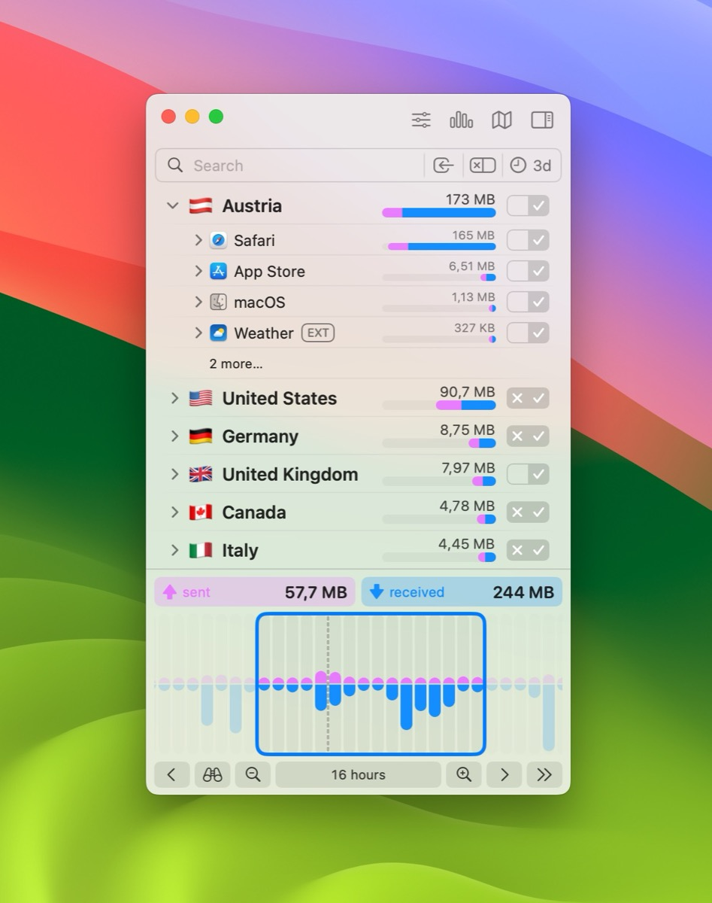
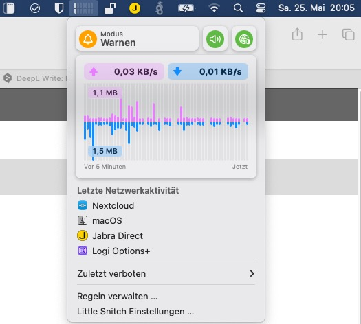

## Backups are essential for any use case and while there are many solutions on the market, some apps stand out for their level of flexibility. Time Machine on the Mac already does a great job, but is limited to connected drives - so how do you back up on the move? Enter, Arq Backup!

Traveling with your important data doesn't have to mean skipping backups or combining them with a device you're already carrying - just imagine if all your luggage got stolen or lost. Although Apple's built-in Time Machine works well with connected USB drives or via SMB shares when you are at home, there is an obvious gap when you are on the move. Filling this gap is the task of Arq Backup which is available for Windows and Mac, but as a long-time Mac user I will focus on the latter edition of the application, created by Haystack Software LLC and founder Stefan Reitshamer.

To be honest, for most people and use cases, Time Machine will do exactly what you need it to do, but you'll have to stick with Apple's configuration unless you want to use tweaking tools to deal with backup iterations and similar. If you want to push your backups to other repositories like Microsoft OneDrive, an S3-compatible target like my beloved Wasabi or even an SFTP server, an attached hard drive or a network share, you may need something more. If backup frequency and bandwidth control/throttling, even on the move, is also a requirement, Arq Backup may be the software you have been looking for.

## What does Arq Backup do?

While installing Arq Backup on a Mac is fairly straightforward (just download the application, drag and drop it into your Applications folder and give it full disk access so that all backup sources can be read), the application's appearance is less fancy and more versatile under the hood, focusing on the essentials - don't expect a polished, Cupertino-like application here! Arq Backup works with an agent running in the background and a frontend where all those numerous options can be configured. 

My use case has always been "deny all" in terms of incoming (of course) and outgoing traffic. For me, the way Little Snitch works is that once it is deployed and allowed to sniff the traffic, it alerts me on every connection that any kind of software or service initiates and lets me choose what actions to take for that specific request: For example, a local application that just needs to check for updates can be regulated to use only a specific host and port 443 (TCP) for SSL traffic so that it can check whether an update is available or not. No more, no less - and tracking apps that try to 'phone home' for whatever reason may become a relic of the past with Little Snitch.

The new version comes with some new features like DNS-encryption, a convenient access to blocklists, an optically revamped traffic chart, a more versatile control center in macOS’ menu bar or even sound notifications in case an app hits Little Snitch initial software firewall.

## The new features in detail

- DNS encryption: As long as your provider does this or you are using one of the DNS-encrypted nameservers out there, everything is fine. If this isn't the case, Little Snitch 6 also offers the option to add custom name servers to suit specific needs or to avoid the more famous DNS servers out there
- Integrated blocklists: Users can easily select from a curated list of blocklists and install them with a single click to add an extra layer of protection against unwanted connections
- New control center on the menu bar: Get quick, at-a-glance access to key network information, recent activity graphs and recently blocked connections right at the top of your screen
- Usage statistics: Track and optimize your firewall rules based on usage frequency
- Enhanced web application support: Gain better and more granular control over external connections initiated by web pages
- Improved firewall rules: Use cryptographic code signing identifiers for better process identification, resistant to application renaming or moving
- and many more!

After the initial installation (and assuming you choose the "Alert" mode first), Little Snitch will nag you with lots of notifications about background services or initiated connections and as you open each additional application, the basic ruleset will grow to provide a solid foundation for your specific use case on MacOS and the traffic happening from your machine. This ruleset can of course be modified, deleted or enriched with additional blocklists that many users will already be familiar with (Peter Lowe's, Ad Away or URLhaus to name a few - adding custom ones is also possible!), so securing your Mac's outgoing traffic is a simple process, even when you're on the go, and this process has become even easier with the new features of Little Snitch 6.

As always, it's up to you whether you need a product like Little Snitch or not. If you don't care which packets leave your machine in which direction - fine. But if you do and you want to regulate them or just see what's happening to them, this one might be of particular interest to you. Little Snitch doesn't use too many system resources, and the utility itself only uses 0.7% of the CPU when doing its usual work - so there's no compromise between security, resources and visual usability.

I've been using Little Snitch for years and it quickly became my daily driver on all the Macs I've owned over the years - and once it's learned its initial set of rules, it rarely pops out of the background so you won't even know it's there unless it says „Hello!“: There are no distractions at all!

## Pricing and availability

At the time of writing, Arq Backup 7 is the latest iteration and is available for macOS (version 7.26.10) and Windows (version 7.27.8.0) with a 30-day trial. The standard version costs $49.99 when first purchased, with renewal at $25.00 per year for a single computer. Arq Premium includes five computers and 1 TB of included storage plus web access to backups for $59.99/year. For the latter, the storage location can be selected from three locations in the US, Finland, Belgium, the Netherlands, Singapore or Taiwan to meet specific, GDPR-compliant needs and regulations.

Arq Backup can be downloaded from the official website [here](https://www.arqbackup.com/download/).