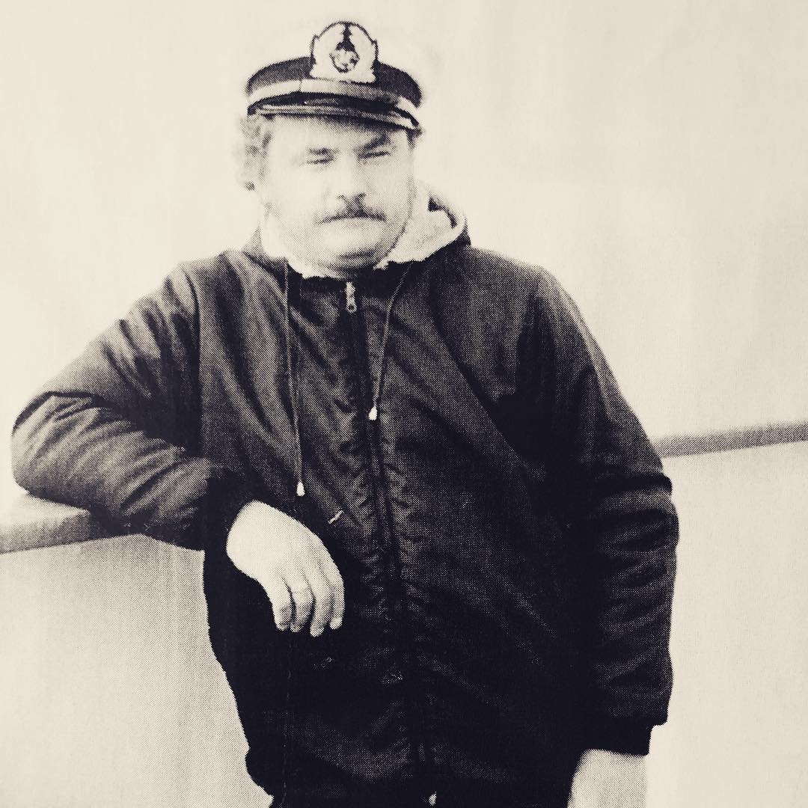
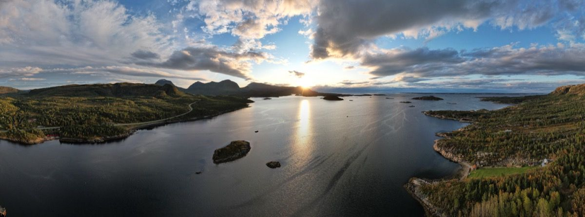

## I have never been the typical homelike guy - after all, I managed just to live in three cities my whole life but with each travel, my wanderlust grows even more and so do the dreams of living at a place that’s good for me.

Born in a German city in the Ruhr Area, I moved to yet another industrial city with seven and stayed there for fifteen years before moving back to my origin city due to former friends. While my grandparents still live there, there are were no real aspects that kept me there once I got to know my later wife and moved to the Münsterland area approximately 50 kilometers away in 2005. Since 18 years, I call the small town I am living in my homeplace but except my family (wife and children), there is not much that keeps me at this specific place.

This may sound quite sad (especially as I adore people who are proud residents of the place they were born at and stay there all their life) but the spirit of wanderlust is something that the mother-based part of my family tree brought into my life: My grand dad, who died in 2018, was entitled „Henry the Conqueror“ as he ventured through the world while being a piano player on a  big cruise ship after surviving the aftermath of World War II. He used to live in Finland for many, many years and then moved to Germany where my grandma and my mother waited for him for many years. It’s a great and sad story of the 20th century, but wherever he was, he extended his own horizon, saw nearly the whole world and got to know many cultures. He was always the open-minded guy, thirsting for the new experiences and could never hold on until his ongoing journey ended in 2018.

My mum - his daughter - went the same way and is today still open-minded towards seeing new things, countries and learning from other cultures. These characteristics have possibly always been latent in my personality but definitely grew over the years after seeing other ports of the world than the usual Spanish holiday places I knew from my childhood: The Netherlands, England, Scotland, Belgium, the USA, Denmark and... finally... Norway. There have been some cultural clashes but even seeing Silicon Valley live in 2018 and facing in love with this (expensive) area can't be compared to the impressions Norway had on me. Because of other events, I already wrote about [live being vivid](../Life-is-vivid-try-to-live-it-that-way!/) in 2022 or talkshopped on [yet another writer's block](../I-am-stuck-writers-block-or-just-silly-season/) in 2021 but indeed the outstanding beauty of Norse nature, the few but friendly people and the versatility of this narrow but long-drawn out Scandinavian country made be to instantly fall in love with it.

The third consecutive year since 2021, we lately made it to Norway, slowly proceeding from the far South to the South to a place that wasn't still really North but at least something in the nearly middle of the country: The Kristiansund-area near Aure in Foldfjorden. 

